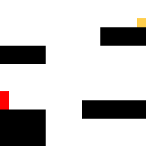
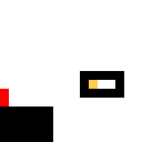
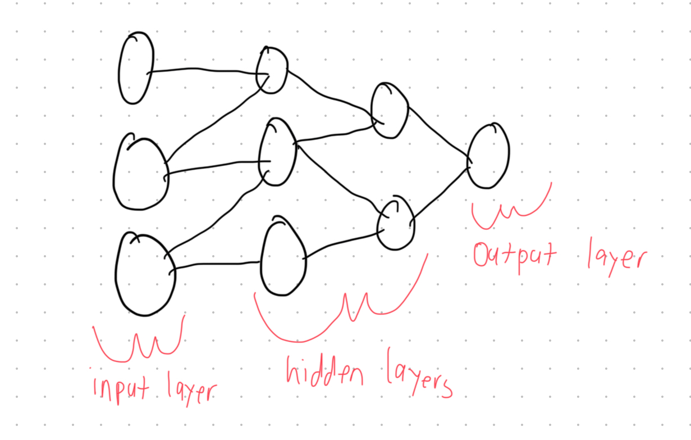

# Summary
This project is in its early stages, but I do have a plan for it. My current goal is to build an AI that can 
tell me if a puzzle level is completable. Using the neural network I can first have something that generates random 
levels and then using the neural network only the completable levels will be kept. The next level would be to create
 an AI that can generate for me good puzzle levels. I do not know how all of this will look right now, but this 
should be a fun project. I thought it would be fun to learn more about AI and neural networks and what better 
way than to do it myself! I will be using some sort of training algorithm - maybe some form of backpropogation.

# Sample Input and Output
I currently think that the best way to do this is to simplify the game (at least initially). I am currently thinking of only using three colors and having a 16 x 16 pixel grid. Where 
the actual puzzle game (which I may eventually give as input) is Full HD. 
This means that a 1920 x 1080 pixel grid would be passed as input. Simplifying that to a 16 x 16 grid should 
hopefully allow me to get a proof of concept quickly and then I could maybe work my way up to the actual game. 
Now let's go through what the three colors are and what they mean. The red pixels are the player (the player is 
1 x 2 object on the grid). Black is the platforms. And yellow is the goal the player has to reach. They then 
have to work their way back to the initial position to complete the level. Now let's 
see two sample inputs and the expected outputs. The light gray is just to make the image easier to look at (those light gray pixels won't be passed into the neural network).

## A Completable Level

## An Impossible Level

# How I am approaching the neural network
I am currently planning on writing the neural network how I would write a graph. The entire network is the graph.
 The neuron is the vertex and the synapse is the edge. To be precise, the network will be a weighted, directed, and acyclical 
graph. Each neuron's value will be the dot product of all the neuron and synapse values going into it (the activation function). The input it gives will be the weight of the synapse connection multiplied by the current neuron level. So I will have 
an input layer of 256 neurons (the size of the input image). Then I will have two hidden layers and my goal with that is to 
have the layers implicitly discover "features" of the original image. Then the output layer will be a single neuron. Going with the graph analogy, I will be going with a breadth first search starting at the input layer and ending 
on the output layer. Once the breadth first search is completed the result will be whether the output layer 
neuron has fired or not (fires means the level is completable). Below I have an image of the neural network. The image is not drawn to scale, but it shows the general idea. 

